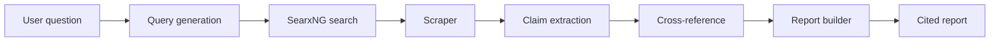

# DeepDive

[](LICENSE)

[](https://github.com/openintelligence-labs/agentic-kit)

> **Open source alternative to Perplexity Pro ($200/yr).** A deep research agent that autonomously searches 30+ sources, cross-references claims, detects contradictions, and produces a structured report with inline citations. Runs 100% locally via Ollama.

⭐ **Star us on GitHub** if you've ever paid for research you could've done with a local model.

## Why this exists

ChatGPT Deep Research and Perplexity Pro do real multi-step research — but they're closed-source, cloud-only, and charge hundreds of dollars a year. Perplexica and other open alternatives are just search wrappers. DeepDive is the actual agent: it plans queries, scrapes the web, extracts claims, cross-references across sources, and writes a cited report. All local, all free.

## Quick start

```bash
# 1. Start Ollama + SearxNG + DeepDive
docker compose up -d

# 2. Pull a model
ollama pull llama3.2

# 3. From the terminal — streamed to a Markdown file
deepdive research "What caused the 2008 financial crisis?" -o crisis.md

# 4. Or hit the API (SSE for live progress)
curl -N -X POST http://localhost:8000/api/research \
  -H "Content-Type: application/json" \
  -d '{"question": "Compare quantum computing approaches for drug discovery"}'

# 5. Or ask for just the Markdown report
curl -X POST http://localhost:8000/api/research/markdown \
  -H "Content-Type: application/json" \
  -d '{"question": "What are the main climate feedback loops?"}'
```

## Features

| Feature | What it does |
|---|---|
| Autonomous search | Generates 5 diverse queries per question, runs them via SearxNG |
| Web scraping | Fetches top results in parallel with timeouts and retries |
| Claim extraction | Pulls verifiable facts from each page, with source attribution |
| Cross-referencing | Merges duplicate claims, boosts confidence when multiple sources agree |
| Structured reports | Background / Findings / Contradictions sections with inline citations |
| Real-time progress | Server-sent events stream every step to the UI |
| 100% local | Ollama default, no API key required |

## How it works



## Configuration

All settings read from env with prefix `DEEPDIVE_`:

```bash
export DEEPDIVE_LLM_MODEL=llama3.2
export DEEPDIVE_LLM_BASE_URL=http://localhost:11434
export DEEPDIVE_SEARXNG_BASE_URL=http://localhost:8888
export DEEPDIVE_QUERIES_PER_QUESTION=5
export DEEPDIVE_RESULTS_PER_QUERY=5
export DEEPDIVE_MAX_PAGES_PER_RESEARCH=30
```

## Roadmap

- [x] Search pipeline with SearxNG + DuckDuckGo
- [x] Parallel scraping with selectolax
- [x] Claim extraction + cross-referencing (provider-agnostic via `LLM.extract`)
- [x] Structured report with citations
- [x] SSE streaming API + Markdown endpoint
- [x] Rich CLI with live progress + Markdown export (`--output`)
- [ ] Next.js frontend with real-time progress UI
- [ ] PDF export
- [ ] Playwright fallback for JS-heavy sites
- [ ] Semantic caching of page content (via agentic-kit `SqliteVecCache`)

## Contributing

See [CONTRIBUTING.md](CONTRIBUTING.md). Join us on [Discord](https://discord.gg/openintelligence-labs).

## Part of the Open Intelligence Labs ecosystem

DeepDive is part of the [Open Intelligence Labs](https://github.com/openintelligence-labs) ecosystem — open source AI tools that replace expensive SaaS.

- [agentic-kit](https://github.com/openintelligence-labs/agentic-kit) — the shared SDK that powers DeepDive's LLM calls
- [MeetMind](https://github.com/openintelligence-labs/meetmind) — local meeting assistant (replaces Otter.ai)
- [SecondBrain](https://github.com/openintelligence-labs/secondbrain) — personal AI memory (replaces Rewind.ai)
- [TokenMiser](https://github.com/openintelligence-labs/tokenmiser) — smart LLM router that cuts agent costs 10x

## License

MIT
